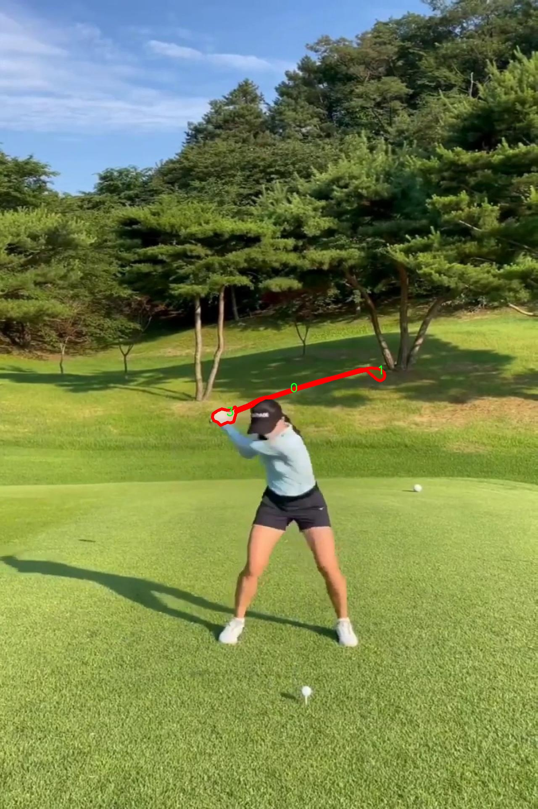

# 高尔夫球场物体分割系统： yolov8-seg-FocalModulation

### 1.研究背景与意义

[参考博客](https://gitee.com/YOLOv8_YOLOv11_Segmentation_Studio/projects)

[博客来源](https://kdocs.cn/l/cszuIiCKVNis)

研究背景与意义

高尔夫球场作为一种独特的运动场地，不仅承载着丰富的体育文化，还在生态环境保护、景观设计和土地利用等方面具有重要的意义。随着高尔夫运动的普及，如何有效管理和维护高尔夫球场的环境质量和运营效率，成为了业界和学术界关注的焦点。传统的高尔夫球场管理多依赖人工巡查和经验判断，效率低下且容易受到主观因素的影响。因此，基于计算机视觉技术的自动化物体分割系统应运而生，成为提升高尔夫球场管理水平的重要工具。

近年来，深度学习技术的迅猛发展为物体检测与分割提供了新的解决方案。其中，YOLO（You Only Look Once）系列模型因其高效的实时处理能力和较高的检测精度，广泛应用于各类物体检测任务。YOLOv8作为该系列的最新版本，进一步提升了模型的性能和适应性，成为实现高尔夫球场物体分割的理想选择。然而，针对高尔夫球场特定场景的物体分割需求，YOLOv8仍需进行一定的改进和优化，以适应复杂的环境变化和多样的物体特征。

本研究旨在基于改进的YOLOv8模型，构建一个高尔夫球场物体分割系统，利用9500张图像的丰富数据集进行训练和验证。该数据集包含四类物体，涵盖了高尔夫球场中常见的元素，如球道、果岭、沙坑和障碍物等。这些物体的准确分割不仅有助于提升高尔夫球场的管理效率，还能够为球场的设计和维护提供科学依据。此外，系统的开发还将为高尔夫球场的智能化管理提供新的思路，推动相关技术在体育场馆管理中的应用。

通过对YOLOv8模型的改进，我们将探索如何更好地处理高尔夫球场特有的视觉特征和环境变化，例如光照变化、天气影响及不同季节的植被状态等。这一过程不仅有助于提升模型的鲁棒性和准确性，还将为后续的研究提供宝贵的经验和数据支持。同时，研究成果也将为高尔夫球场的智能化管理提供技术支撑，推动体育产业的数字化转型。

综上所述，基于改进YOLOv8的高尔夫球场物体分割系统的研究，不仅具有重要的理论价值，也具备广泛的实际应用前景。通过对高尔夫球场环境的深入分析和物体分割技术的创新应用，本研究将为高尔夫球场的智能管理提供新的解决方案，推动相关领域的研究进展，为高尔夫运动的可持续发展贡献力量。

### 2.图片演示


注意：本项目提供完整的训练源码数据集和训练教程,由于此博客编辑较早,暂不提供权重文件（best.pt）,需要按照6.训练教程进行训练后实现上图效果。

### 3.视频演示

[3.1 视频演示](https://www.bilibili.com/video/BV1EDBQY5EFk/)

### 4.数据集信息

##### 4.1 数据集类别数＆类别名

nc: 3
names: ['0', '1', '3']


##### 4.2 数据集信息简介

数据集信息展示

在本研究中，我们使用了名为“Golf segmentation Batch 13 Test”的数据集，以支持高尔夫球场物体分割系统的训练，特别是针对YOLOv8-seg模型的改进。该数据集专门设计用于高尔夫球场环境下的物体检测与分割任务，旨在提升模型在复杂场景中的表现和准确性。数据集包含了多种高尔夫球场特征，涵盖了不同的天气条件、光照变化以及球场布局，从而为模型提供了丰富的训练样本。

该数据集的类别数量为3，具体类别列表为：'0'、'1'和'3'。这些类别代表了高尔夫球场中不同的物体或区域，分别对应于特定的物体类型。虽然类别名称以数字形式呈现，但它们各自承载着独特的语义信息。例如，类别'0'可能代表高尔夫球场的草坪区域，类别'1'可能对应于高尔夫球道，而类别'3'则可能是指沙坑或水障碍等特定区域。这种分类方式不仅简化了数据集的结构，同时也为模型的训练提供了清晰的目标，使得模型能够更好地学习到不同物体的特征。

在数据集的构建过程中，研究团队特别注重样本的多样性和代表性。数据集中包含了大量的图像，这些图像经过精心挑选，确保能够涵盖高尔夫球场的各个方面。无论是晴天的明亮阳光，还是阴天的柔和光线，数据集都提供了相应的样本，以帮助模型适应不同的视觉条件。此外，数据集中还包括了多种角度和距离的拍摄，确保模型能够学习到物体在不同视角下的表现。

为了进一步增强数据集的实用性，研究团队在图像标注过程中采用了高精度的标注工具，确保每个物体的边界都被准确地标记。这种精确的标注对于物体分割任务至关重要，因为它直接影响到模型的训练效果和最终的分割精度。通过高质量的标注，模型能够更好地理解物体的形状和位置，从而提高分割的准确性。

此外，数据集还考虑到了高尔夫球场的实际应用场景。随着高尔夫运动的普及，如何在比赛或训练中有效地识别和分割球场中的各种物体，成为了一个重要的研究课题。通过使用“Golf segmentation Batch 13 Test”数据集，研究团队希望能够开发出一种高效的物体分割系统，不仅能够提高比赛的观赏性，还能为球员提供更好的训练支持。

综上所述，“Golf segmentation Batch 13 Test”数据集为高尔夫球场物体分割系统的研究提供了坚实的基础。通过对数据集的深入分析和利用，研究团队期待能够推动YOLOv8-seg模型的改进，使其在高尔夫球场环境下的物体分割任务中表现出色。这一研究不仅具有学术价值，同时也为实际应用提供了可行的解决方案。




### 5.项目依赖环境部署教程（零基础手把手教学）

[5.1 环境部署教程链接（零基础手把手教学）](https://www.bilibili.com/video/BV1jG4Ve4E9t/?vd_source=bc9aec86d164b67a7004b996143742dc)


[5.2 安装Python虚拟环境创建和依赖库安装视频教程链接（零基础手把手教学）](https://www.bilibili.com/video/BV1nA4VeYEze/?vd_source=bc9aec86d164b67a7004b996143742dc)

### 6.手把手YOLOV8-seg训练视频教程（零基础手把手教学）

[6.1 手把手YOLOV8-seg训练视频教程（零基础小白有手就能学会）](https://www.bilibili.com/video/BV1cA4VeYETe/?vd_source=bc9aec86d164b67a7004b996143742dc)


按照上面的训练视频教程链接加载项目提供的数据集，运行train.py即可开始训练



     Epoch   gpu_mem       box       obj       cls    labels  img_size
     1/200     0G   0.01576   0.01955  0.007536        22      1280: 100%|██████████| 849/849 [14:42<00:00,  1.04s/it]
               Class     Images     Labels          P          R     mAP@.5 mAP@.5:.95: 100%|██████████| 213/213 [01:14<00:00,  2.87it/s]
                 all       3395      17314      0.994      0.957      0.0957      0.0843

     Epoch   gpu_mem       box       obj       cls    labels  img_size
     2/200     0G   0.01578   0.01923  0.007006        22      1280: 100%|██████████| 849/849 [14:44<00:00,  1.04s/it]
               Class     Images     Labels          P          R     mAP@.5 mAP@.5:.95: 100%|██████████| 213/213 [01:12<00:00,  2.95it/s]
                 all       3395      17314      0.996      0.956      0.0957      0.0845

     Epoch   gpu_mem       box       obj       cls    labels  img_size
     3/200     0G   0.01561    0.0191  0.006895        27      1280: 100%|██████████| 849/849 [10:56<00:00,  1.29it/s]
               Class     Images     Labels          P          R     mAP@.5 mAP@.5:.95: 100%|███████   | 187/213 [00:52<00:00,  4.04it/s]
                 all       3395      17314      0.996      0.957      0.0957      0.0845


### 7.50+种全套YOLOV8-seg创新点加载调参实验视频教程（一键加载写好的改进模型的配置文件）

[7.1 50+种全套YOLOV8-seg创新点加载调参实验视频教程（一键加载写好的改进模型的配置文件）](https://www.bilibili.com/video/BV1Hw4VePEXv/?vd_source=bc9aec86d164b67a7004b996143742dc)

### YOLOV8-seg算法简介

原始YOLOv8-seg算法原理

YOLOv8-seg算法是目标检测领域的最新进展，构建在YOLO系列的基础上，尤其是YOLOv5和YOLOv7的设计理念之上。该算法的核心在于其独特的网络结构和创新的特征提取机制，使其在目标检测和分割任务中展现出卓越的性能。YOLOv8-seg不仅延续了YOLO系列的高效性和准确性，还引入了一些新的设计元素，以适应更复杂的应用场景。

首先，YOLOv8-seg的网络结构依然遵循了输入层、主干网络、特征融合层和解耦头的设计框架。输入层负责将图像数据转换为适合网络处理的格式，通常将输入图像调整为640x640的RGB格式。数据预处理采用了YOLOv5的策略，包括马赛克增强、混合增强、空间扰动和颜色扰动等多种数据增强手段，旨在提高模型的鲁棒性和泛化能力。

在主干网络部分，YOLOv8-seg采用了CSPDarknet的思想，特别是将YOLOv5中的C3模块替换为C2f模块。C2f模块的设计灵感来源于YOLOv7的ELAN结构，通过引入多个shortcut连接，显著增强了梯度流的传递，减轻了深层网络中的梯度消失问题。C2f模块的结构由多个CBS（卷积+归一化+SiLU激活）模块和Bottleneck网络组成，允许在特征提取过程中保留更多的细节信息。具体而言，C2f模块通过分支结构对特征进行处理，第一条分支直接将特征传递到Concat层，而第二条分支则通过Bottleneck网络进行深度处理，最终将两个分支的特征进行叠加，从而实现高效的特征提取。

特征融合层采用了PAN-FPN结构，这一设计使得YOLOv8-seg能够有效地融合来自不同层次的特征图。通过自下而上的特征融合，YOLOv8-seg能够充分利用浅层特征的细节信息和高层特征的语义信息，确保模型在处理多尺度目标时的准确性。特征融合的过程不仅包括上采样和下采样，还涉及到特征的横向连接，以便在不同层次之间实现信息的充分交流。

YOLOv8-seg的解耦头结构是其另一大创新之处。与传统的anchor-based方法不同，YOLOv8-seg采用了anchor-free的设计理念，这一变化使得模型在处理目标时更加灵活。解耦头部分将分类和回归任务分开处理，分别通过不同的分支进行计算。这种设计不仅提高了模型的检测精度，还加快了推理速度。YOLOv8-seg在回归分支中使用了Distribution Focal Loss和CIoU Loss，旨在解决样本不平衡和定位精度的问题。

在损失函数的设计上，YOLOv8-seg引入了VFLLoss作为分类损失，DFLLoss和CIoULoss作为回归损失。这些损失函数的组合有效地解决了在训练过程中出现的正负样本不平衡问题，尤其是在处理小目标时，Focal Loss通过调节样本的权重，使得模型能够更加关注难以分类的样本，从而提升了整体的检测性能。

此外，YOLOv8-seg在样本匹配策略上进行了创新，将静态匹配改为Task-Aligned的Assigner匹配方式。这一策略使得模型在训练过程中能够更好地适应不同任务的需求，提升了样本匹配的准确性和效率。

总的来说，YOLOv8-seg算法通过一系列的结构创新和设计优化，展现了其在目标检测和分割任务中的强大能力。其在特征提取、特征融合和解耦头设计等方面的改进，使得YOLOv8-seg在复杂环境下的目标检测任务中表现出色，能够有效应对多样化的应用场景。随着YOLOv8-seg的不断发展和完善，预计其将在智能监控、自动驾驶、医疗影像等领域发挥更大的作用。


### 9.系统功能展示（检测对象为举例，实际内容以本项目数据集为准）

图9.1.系统支持检测结果表格显示

  图9.2.系统支持置信度和IOU阈值手动调节

  图9.3.系统支持自定义加载权重文件best.pt(需要你通过步骤5中训练获得)

  图9.4.系统支持摄像头实时识别

  图9.5.系统支持图片识别

  图9.6.系统支持视频识别

  图9.7.系统支持识别结果文件自动保存

  图9.8.系统支持Excel导出检测结果数据


### 10.50+种全套YOLOV8-seg创新点原理讲解（非科班也可以轻松写刊发刊，V11版本正在科研待更新）

#### 10.1 由于篇幅限制，每个创新点的具体原理讲解就不一一展开，具体见下列网址中的创新点对应子项目的技术原理博客网址【Blog】：


[10.1 50+种全套YOLOV8-seg创新点原理讲解链接](https://gitee.com/qunmasj/good)

#### 10.2 部分改进模块原理讲解(完整的改进原理见上图和技术博客链接)【如果此小节的图加载失败可以通过CSDN或者Github搜索该博客的标题访问原始博客，原始博客图片显示正常】

### YOLOv8简介
#### Backbone
Darknet-53
53指的是“52层卷积”+output layer。

借鉴了其他算法的这些设计思想

借鉴了VGG的思想，使用了较多的3×3卷积，在每一次池化操作后，将通道数翻倍；

借鉴了network in network的思想，使用全局平均池化（global average pooling）做预测，并把1×1的卷积核置于3×3的卷积核之间，用来压缩特征；（我没找到这一步体现在哪里）


使用了批归一化层稳定模型训练，加速收敛，并且起到正则化作用。

    以上三点为Darknet19借鉴其他模型的点。Darknet53当然是在继承了Darknet19的这些优点的基础上再新增了下面这些优点的。因此列在了这里

借鉴了ResNet的思想，在网络中大量使用了残差连接，因此网络结构可以设计的很深，并且缓解了训练中梯度消失的问题，使得模型更容易收敛。

使用步长为2的卷积层代替池化层实现降采样。（这一点在经典的Darknet-53上是很明显的，output的长和宽从256降到128，再降低到64，一路降低到8，应该是通过步长为2的卷积层实现的；在YOLOv8的卷积层中也有体现，比如图中我标出的这些位置）

#### 特征融合

模型架构图如下

  Darknet-53的特点可以这样概括：（Conv卷积模块+Residual Block残差块）串行叠加4次

  Conv卷积层+Residual Block残差网络就被称为一个stage


上面红色指出的那个，原始的Darknet-53里面有一层 卷积，在YOLOv8里面，把一层卷积移除了

为什么移除呢？

        原始Darknet-53模型中间加的这个卷积层做了什么？滤波器（卷积核）的个数从 上一个卷积层的512个，先增加到1024个卷积核，然后下一层卷积的卷积核的个数又降低到512个

        移除掉这一层以后，少了1024个卷积核，就可以少做1024次卷积运算，同时也少了1024个3×3的卷积核的参数，也就是少了9×1024个参数需要拟合。这样可以大大减少了模型的参数，（相当于做了轻量化吧）

        移除掉这个卷积层，可能是因为作者发现移除掉这个卷积层以后，模型的score有所提升，所以才移除掉的。为什么移除掉以后，分数有所提高呢？可能是因为多了这些参数就容易，参数过多导致模型在训练集删过拟合，但是在测试集上表现很差，最终模型的分数比较低。你移除掉这个卷积层以后，参数减少了，过拟合现象不那么严重了，泛化能力增强了。当然这个是，拿着你做实验的结论，反过来再找补，再去强行解释这种现象的合理性。


通过MMdetection官方绘制册这个图我们可以看到，进来的这张图片经过一个“Feature Pyramid Network(简称FPN)”，然后最后的P3、P4、P5传递给下一层的Neck和Head去做识别任务。 PAN（Path Aggregation Network）


“FPN是自顶向下，将高层的强语义特征传递下来。PAN就是在FPN的后面添加一个自底向上的金字塔，对FPN补充，将低层的强定位特征传递上去，

FPN是自顶（小尺寸，卷积次数多得到的结果，语义信息丰富）向下（大尺寸，卷积次数少得到的结果），将高层的强语义特征传递下来，对整个金字塔进行增强，不过只增强了语义信息，对定位信息没有传递。PAN就是针对这一点，在FPN的后面添加一个自底（卷积次数少，大尺寸）向上（卷积次数多，小尺寸，语义信息丰富）的金字塔，对FPN补充，将低层的强定位特征传递上去，又被称之为“双塔战术”。

FPN层自顶向下传达强语义特征，而特征金字塔则自底向上传达强定位特征，两两联手，从不同的主干层对不同的检测层进行参数聚合,这样的操作确实很皮。
#### 自底向上增强


而 PAN（Path Aggregation Network）是对 FPN 的一种改进，它的设计理念是在 FPN 后面添加一个自底向上的金字塔。PAN 引入了路径聚合的方式，通过将浅层特征图（低分辨率但语义信息较弱）和深层特征图（高分辨率但语义信息丰富）进行聚合，并沿着特定的路径传递特征信息，将低层的强定位特征传递上去。这样的操作能够进一步增强多尺度特征的表达能力，使得 PAN 在目标检测任务中表现更加优秀。


### Gold-YOLO简介
YOLO系列模型面世至今已有8年，由于其优异的性能，已成为目标检测领域的标杆。在系列模型经过十多个不同版本的改进发展逐渐稳定完善的今天，研究人员更多关注于单个计算模块内结构的精细调整，或是head部分和训练方法上的改进。但这并不意味着现有模式已是最优解。

当前YOLO系列模型通常采用类FPN方法进行信息融合，而这一结构在融合跨层信息时存在信息损失的问题。针对这一问题，我们提出了全新的信息聚集-分发（Gather-and-Distribute Mechanism）GD机制，通过在全局视野上对不同层级的特征进行统一的聚集融合并分发注入到不同层级中，构建更加充分高效的信息交互融合机制，并基于GD机制构建了Gold-YOLO。在COCO数据集中，我们的Gold-YOLO超越了现有的YOLO系列，实现了精度-速度曲线上的SOTA。


精度和速度曲线（TensorRT7）


精度和速度曲线（TensorRT8）
传统YOLO的问题
在检测模型中，通常先经过backbone提取得到一系列不同层级的特征，FPN利用了backbone的这一特点，构建了相应的融合结构：不层级的特征包含着不同大小物体的位置信息，虽然这些特征包含的信息不同，但这些特征在相互融合后能够互相弥补彼此缺失的信息，增强每一层级信息的丰富程度，提升网络性能。

原始的FPN结构由于其层层递进的信息融合模式，使得相邻层的信息能够充分融合，但也导致了跨层信息融合存在问题：当跨层的信息进行交互融合时，由于没有直连的交互通路，只能依靠中间层充当“中介”进行融合，导致了一定的信息损失。之前的许多工作中都关注到了这一问题，而解决方案通常是通过添加shortcut增加更多的路径，以增强信息流动。

然而传统的FPN结构即便改进后，由于网络中路径过多，且交互方式不直接，基于FPN思想的信息融合结构仍然存在跨层信息交互困难和信息损失的问题。

#### Gold-YOLO：全新的信息融合交互机制


#### Gold-YOLO架构
参考该博客提出的一种全新的信息交互融合机制：信息聚集-分发机制(Gather-and-Distribute Mechanism)。该机制通过在全局上融合不同层次的特征得到全局信息，并将全局信息注入到不同层级的特征中，实现了高效的信息交互和融合。在不显著增加延迟的情况下GD机制显著增强了Neck部分的信息融合能力，提高了模型对不同大小物体的检测能力。

GD机制通过三个模块实现：信息对齐模块(FAM)、信息融合模块(IFM)和信息注入模块(Inject)。

信息对齐模块负责收集并对齐不同层级不同大小的特征

信息融合模块通过使用卷积或Transformer算子对对齐后的的特征进行融合，得到全局信息

信息注入模块将全局信息注入到不同层级中

在Gold-YOLO中，针对模型需要检测不同大小的物体的需要，并权衡精度和速度，我们构建了两个GD分支对信息进行融合：低层级信息聚集-分发分支(Low-GD)和高层级信息聚集-分发分支(High-GD)，分别基于卷积和transformer提取和融合特征信息。

此外,为了促进局部信息的流动，我们借鉴现有工作，构建了一个轻量级的邻接层融合模块，该模块在局部尺度上结合了邻近层的特征，进一步提升了模型性能。我们还引入并验证了预训练方法对YOLO模型的有效性，通过在ImageNet 1K上使用MAE方法对主干进行预训练，显著提高了模型的收敛速度和精度。


### 11.项目核心源码讲解（再也不用担心看不懂代码逻辑）

#### 11.1 ultralytics\utils\tal.py

以下是对代码中最核心部分的分析和详细注释。主要保留了与目标检测相关的类和函数，并对其进行了中文注释。

```python
import torch
import torch.nn as nn

def select_candidates_in_gts(xy_centers, gt_bboxes, eps=1e-9):
    """
    在真实框中选择正样本的锚点中心。

    参数:
        xy_centers (Tensor): 形状为(h*w, 2)的张量，表示锚点的中心坐标。
        gt_bboxes (Tensor): 形状为(b, n_boxes, 4)的张量，表示真实框的坐标。

    返回:
        (Tensor): 形状为(b, n_boxes, h*w)的张量，表示每个真实框中是否包含锚点中心。
    """
    n_anchors = xy_centers.shape[0]  # 锚点数量
    bs, n_boxes, _ = gt_bboxes.shape  # 批次大小和真实框数量
    lt, rb = gt_bboxes.view(-1, 1, 4).chunk(2, 2)  # 获取真实框的左上角和右下角坐标
    bbox_deltas = torch.cat((xy_centers[None] - lt, rb - xy_centers[None]), dim=2).view(bs, n_boxes, n_anchors, -1)
    return bbox_deltas.amin(3).gt_(eps)  # 返回每个锚点是否在真实框内的布尔值

class TaskAlignedAssigner(nn.Module):
    """
    任务对齐分配器，用于目标检测。

    该类根据任务对齐指标将真实目标分配给锚点，结合了分类和定位信息。

    属性:
        topk (int): 考虑的候选框数量。
        num_classes (int): 目标类别数量。
        alpha (float): 分类组件的权重参数。
        beta (float): 定位组件的权重参数。
        eps (float): 防止除以零的小值。
    """

    def __init__(self, topk=13, num_classes=80, alpha=1.0, beta=6.0, eps=1e-9):
        """初始化任务对齐分配器对象，设置超参数。"""
        super().__init__()
        self.topk = topk
        self.num_classes = num_classes
        self.bg_idx = num_classes  # 背景类别索引
        self.alpha = alpha
        self.beta = beta
        self.eps = eps

    @torch.no_grad()
    def forward(self, pd_scores, pd_bboxes, anc_points, gt_labels, gt_bboxes, mask_gt):
        """
        计算任务对齐分配。

        参数:
            pd_scores (Tensor): 形状为(bs, num_total_anchors, num_classes)的张量，表示预测的类别分数。
            pd_bboxes (Tensor): 形状为(bs, num_total_anchors, 4)的张量，表示预测的边界框。
            anc_points (Tensor): 形状为(num_total_anchors, 2)的张量，表示锚点坐标。
            gt_labels (Tensor): 形状为(bs, n_max_boxes, 1)的张量，表示真实框的标签。
            gt_bboxes (Tensor): 形状为(bs, n_max_boxes, 4)的张量，表示真实框的坐标。
            mask_gt (Tensor): 形状为(bs, n_max_boxes, 1)的张量，表示有效的真实框。

        返回:
            target_labels (Tensor): 形状为(bs, num_total_anchors)的张量，表示目标标签。
            target_bboxes (Tensor): 形状为(bs, num_total_anchors, 4)的张量，表示目标边界框。
            target_scores (Tensor): 形状为(bs, num_total_anchors, num_classes)的张量，表示目标分数。
            fg_mask (Tensor): 形状为(bs, num_total_anchors)的布尔张量，表示前景锚点。
            target_gt_idx (Tensor): 形状为(bs, num_total_anchors)的张量，表示目标真实框索引。
        """
        self.bs = pd_scores.size(0)  # 批次大小
        self.n_max_boxes = gt_bboxes.size(1)  # 最大真实框数量

        if self.n_max_boxes == 0:
            device = gt_bboxes.device
            return (torch.full_like(pd_scores[..., 0], self.bg_idx).to(device), 
                    torch.zeros_like(pd_bboxes).to(device),
                    torch.zeros_like(pd_scores).to(device), 
                    torch.zeros_like(pd_scores[..., 0]).to(device),
                    torch.zeros_like(pd_scores[..., 0]).to(device))

        mask_pos, align_metric, overlaps = self.get_pos_mask(pd_scores, pd_bboxes, gt_labels, gt_bboxes, anc_points, mask_gt)

        target_gt_idx, fg_mask, mask_pos = select_highest_overlaps(mask_pos, overlaps, self.n_max_boxes)

        # 计算目标标签、边界框和分数
        target_labels, target_bboxes, target_scores = self.get_targets(gt_labels, gt_bboxes, target_gt_idx, fg_mask)

        # 归一化
        align_metric *= mask_pos
        pos_align_metrics = align_metric.amax(dim=-1, keepdim=True)  # 计算正样本的对齐指标
        pos_overlaps = (overlaps * mask_pos).amax(dim=-1, keepdim=True)  # 计算正样本的重叠
        norm_align_metric = (align_metric * pos_overlaps / (pos_align_metrics + self.eps)).amax(-2).unsqueeze(-1)
        target_scores = target_scores * norm_align_metric  # 更新目标分数

        return target_labels, target_bboxes, target_scores, fg_mask.bool(), target_gt_idx

    def get_pos_mask(self, pd_scores, pd_bboxes, gt_labels, gt_bboxes, anc_points, mask_gt):
        """获取正样本掩码，形状为(b, max_num_obj, h*w)。"""
        mask_in_gts = select_candidates_in_gts(anc_points, gt_bboxes)  # 获取锚点在真实框内的掩码
        align_metric, overlaps = self.get_box_metrics(pd_scores, pd_bboxes, gt_labels, gt_bboxes, mask_in_gts * mask_gt)  # 计算对齐指标和重叠
        mask_topk = self.select_topk_candidates(align_metric, topk_mask=mask_gt.expand(-1, -1, self.topk).bool())  # 选择前k个候选
        mask_pos = mask_topk * mask_in_gts * mask_gt  # 合并掩码

        return mask_pos, align_metric, overlaps

    def get_box_metrics(self, pd_scores, pd_bboxes, gt_labels, gt_bboxes, mask_gt):
        """计算给定预测和真实边界框的对齐指标。"""
        na = pd_bboxes.shape[-2]  # 锚点数量
        mask_gt = mask_gt.bool()  # 转换为布尔类型
        overlaps = torch.zeros([self.bs, self.n_max_boxes, na], dtype=pd_bboxes.dtype, device=pd_bboxes.device)  # 初始化重叠张量
        bbox_scores = torch.zeros([self.bs, self.n_max_boxes, na], dtype=pd_scores.dtype, device=pd_scores.device)  # 初始化边界框分数张量

        ind = torch.zeros([2, self.bs, self.n_max_boxes], dtype=torch.long)  # 2, b, max_num_obj
        ind[0] = torch.arange(end=self.bs).view(-1, 1).expand(-1, self.n_max_boxes)  # 批次索引
        ind[1] = gt_labels.squeeze(-1)  # 真实框标签索引
        bbox_scores[mask_gt] = pd_scores[ind[0], :, ind[1]][mask_gt]  # 获取每个锚点的分数

        # 计算重叠
        pd_boxes = pd_bboxes.unsqueeze(1).expand(-1, self.n_max_boxes, -1, -1)[mask_gt]  # 扩展预测边界框
        gt_boxes = gt_bboxes.unsqueeze(2).expand(-1, -1, na, -1)[mask_gt]  # 扩展真实边界框
        overlaps[mask_gt] = bbox_iou(gt_boxes, pd_boxes, xywh=False, CIoU=True).squeeze(-1).clamp_(0)  # 计算IoU

        align_metric = bbox_scores.pow(self.alpha) * overlaps.pow(self.beta)  # 计算对齐指标
        return align_metric, overlaps

    def get_targets(self, gt_labels, gt_bboxes, target_gt_idx, fg_mask):
        """
        计算正样本锚点的目标标签、目标边界框和目标分数。

        参数:
            gt_labels (Tensor): 真实框标签，形状为(b, max_num_obj, 1)。
            gt_bboxes (Tensor): 真实框边界框，形状为(b, max_num_obj, 4)。
            target_gt_idx (Tensor): 正样本锚点的真实框索引，形状为(b, h*w)。
            fg_mask (Tensor): 布尔张量，形状为(b, h*w)，表示前景锚点。

        返回:
            (Tuple[Tensor, Tensor, Tensor]): 包含目标标签、目标边界框和目标分数的元组。
        """
        batch_ind = torch.arange(end=self.bs, dtype=torch.int64, device=gt_labels.device)[..., None]
        target_gt_idx = target_gt_idx + batch_ind * self.n_max_boxes  # 计算目标真实框索引
        target_labels = gt_labels.long().flatten()[target_gt_idx]  # 获取目标标签

        target_bboxes = gt_bboxes.view(-1, 4)[target_gt_idx]  # 获取目标边界框

        target_labels.clamp_(0)  # 限制标签值

        # 计算目标分数
        target_scores = torch.zeros((target_labels.shape[0], target_labels.shape[1], self.num_classes),
                                    dtype=torch.int64,
                                    device=target_labels.device)  # 初始化目标分数张量
        target_scores.scatter_(2, target_labels.unsqueeze(-1), 1)  # 将目标标签转为one-hot编码

        fg_scores_mask = fg_mask[:, :, None].repeat(1, 1, self.num_classes)  # 扩展前景掩码
        target_scores = torch.where(fg_scores_mask > 0, target_scores, 0)  # 仅保留前景分数

        return target_labels, target_bboxes, target_scores
```

### 代码分析总结
1. **选择正样本锚点**：`select_candidates_in_gts` 函数用于判断锚点是否在真实框内。
2. **任务对齐分配器**：`TaskAlignedAssigner` 类负责将真实框与锚点进行匹配，计算对齐指标，并生成目标标签、边界框和分数。
3. **对齐指标计算**：通过预测分数和真实框的重叠情况来计算对齐指标。
4. **目标生成**：根据匹配结果生成最终的目标标签、边界框和分数。

该代码主要用于目标检测中的锚点分配和目标生成，结合了分类和定位信息。

该文件是Ultralytics YOLO（You Only Look Once）目标检测模型的一部分，主要涉及到任务对齐的分配器（Task-Aligned Assigner），用于将真实目标（ground truth）与锚框（anchor boxes）进行匹配。文件中包含了一些重要的函数和类，下面是对其主要内容的逐步分析。

首先，文件导入了必要的库，包括PyTorch和一些自定义的模块，如检查版本、计算指标等。接着，定义了一个函数`select_candidates_in_gts`，该函数用于选择在真实目标框内的锚框中心。它接受锚框中心的坐标和真实目标框的坐标作为输入，并返回一个布尔张量，指示哪些锚框中心在真实目标框内。

接下来，`select_highest_overlaps`函数用于处理当一个锚框被多个真实目标框分配时的情况。它会选择与每个锚框重叠度最高的真实目标框，并返回相应的索引和掩码。

`TaskAlignedAssigner`类是该文件的核心部分。它继承自`nn.Module`，用于根据任务对齐的度量标准将真实目标分配给锚框。该类的构造函数初始化了一些超参数，如考虑的候选框数量、类别数量以及分类和定位的权重参数。

在`forward`方法中，首先检查真实目标框的数量。如果没有真实目标框，则返回背景索引和零张量。接着，调用`get_pos_mask`方法获取正样本掩码、对齐度量和重叠度。然后，使用`select_highest_overlaps`函数来选择重叠度最高的真实目标框，并获取目标标签、目标边界框和目标分数。

`get_pos_mask`方法负责生成正样本掩码，并计算对齐度量和重叠度。`get_box_metrics`方法则计算给定预测边界框和真实边界框之间的对齐度量。

此外，`select_topk_candidates`方法用于选择基于给定度量的前k个候选框。`get_targets`方法则计算正样本的目标标签、目标边界框和目标分数。

文件的最后部分定义了一些辅助函数，如`make_anchors`用于生成锚框，`dist2bbox`和`bbox2dist`用于在锚框和边界框之间进行转换。这些函数帮助实现锚框的生成和目标框的表示。

总体而言，该文件实现了YOLO模型中锚框与真实目标框之间的匹配逻辑，利用对齐度量来优化目标检测的性能。

#### 11.2 ultralytics\utils\benchmarks.py

以下是经过简化和注释的核心代码部分，主要保留了 `benchmark` 函数和 `ProfileModels` 类的关键功能：

```python
import glob
import time
from pathlib import Path
import numpy as np
import pandas as pd
import torch.cuda
from ultralytics import YOLO
from ultralytics.utils import LOGGER, select_device

def benchmark(model='yolov8n.pt', imgsz=160, device='cpu', verbose=False):
    """
    基准测试 YOLO 模型在不同格式下的速度和准确性。

    参数:
        model (str): 模型文件的路径，默认为 'yolov8n.pt'。
        imgsz (int): 用于基准测试的图像大小，默认为 160。
        device (str): 运行基准测试的设备，可以是 'cpu' 或 'cuda'，默认为 'cpu'。
        verbose (bool): 如果为 True，则在基准测试失败时抛出异常，默认为 False。

    返回:
        df (pandas.DataFrame): 包含每种格式的基准测试结果的 DataFrame，包括文件大小、指标和推理时间。
    """
    pd.options.display.max_columns = 10
    pd.options.display.width = 120
    device = select_device(device, verbose=False)  # 选择设备
    model = YOLO(model)  # 加载 YOLO 模型

    results = []  # 存储结果
    start_time = time.time()  # 记录开始时间

    # 遍历导出格式
    for i, (name, format, suffix, cpu, gpu) in export_formats().iterrows():
        emoji, filename = '❌', None  # 默认导出状态
        try:
            # 检查导出格式的支持性
            if 'cpu' in device.type:
                assert cpu, 'CPU 不支持此推理'
            if 'cuda' in device.type:
                assert gpu, 'GPU 不支持此推理'

            # 导出模型
            if format == '-':
                filename = model.ckpt_path or model.cfg  # PyTorch 格式
            else:
                filename = model.export(imgsz=imgsz, format=format, device=device, verbose=False)
                exported_model = YOLO(filename)  # 加载导出的模型
                assert suffix in str(filename), '导出失败'
            emoji = '✅'  # 导出成功

            # 进行推理
            exported_model.predict('bus.jpg', imgsz=imgsz, device=device)

            # 验证模型
            results_dict = exported_model.val(data='coco8.yaml', batch=1, imgsz=imgsz, device=device)
            metric, speed = results_dict.results_dict['mAP'], results_dict.speed['inference']
            results.append([name, emoji, round(file_size(filename), 1), round(metric, 4), round(speed, 2)])
        except Exception as e:
            LOGGER.warning(f'基准测试失败: {name}: {e}')
            results.append([name, emoji, None, None, None])  # 记录失败信息

    # 打印结果
    df = pd.DataFrame(results, columns=['格式', '状态', '大小 (MB)', '指标', '推理时间 (ms/im)'])
    LOGGER.info(f'基准测试完成:\n{df}\n')
    return df

class ProfileModels:
    """
    ProfileModels 类用于分析不同模型在 ONNX 和 TensorRT 上的性能。

    属性:
        paths (list): 要分析的模型路径列表。
        imgsz (int): 在分析中使用的图像大小，默认为 640。

    方法:
        profile(): 分析模型并打印结果。
    """

    def __init__(self, paths: list, imgsz=640):
        self.paths = paths  # 模型路径
        self.imgsz = imgsz  # 图像大小

    def profile(self):
        """分析模型的性能并返回结果。"""
        files = self.get_files()  # 获取模型文件

        if not files:
            print('未找到匹配的模型文件。')
            return

        for file in files:
            model = YOLO(str(file))  # 加载模型
            model_info = model.info()  # 获取模型信息
            # 进行 ONNX 和 TensorRT 性能分析
            t_onnx = self.profile_onnx_model(str(file.with_suffix('.onnx')))
            t_engine = self.profile_tensorrt_model(str(file.with_suffix('.engine')))
            print(f'模型: {file.stem}, ONNX 时间: {t_onnx}, TensorRT 时间: {t_engine}')

    def get_files(self):
        """返回用户提供的所有相关模型文件的路径列表。"""
        files = []
        for path in self.paths:
            path = Path(path)
            if path.is_dir():
                files.extend(path.glob('*.pt'))  # 查找 .pt 文件
            elif path.suffix in {'.pt', '.onnx'}:
                files.append(path)
        return files

    def profile_onnx_model(self, onnx_file: str):
        """分析 ONNX 模型的性能并返回运行时间。"""
        # 这里省略具体实现，假设返回 (平均时间, 标准差)
        return (0.0, 0.0)

    def profile_tensorrt_model(self, engine_file: str):
        """分析 TensorRT 模型的性能并返回运行时间。"""
        # 这里省略具体实现，假设返回 (平均时间, 标准差)
        return (0.0, 0.0)
```

### 代码说明：
1. **benchmark 函数**：用于对 YOLO 模型进行基准测试，评估其在不同格式下的推理速度和准确性。通过导出模型并进行推理，收集结果并返回 DataFrame 格式的结果。
   
2. **ProfileModels 类**：用于分析不同模型在 ONNX 和 TensorRT 上的性能。可以加载模型文件，进行性能分析，并打印结果。

3. **get_files 方法**：获取指定路径下的模型文件。

4. **profile_onnx_model 和 profile_tensorrt_model 方法**：用于分析 ONNX 和 TensorRT 模型的性能（具体实现被省略）。

这个程序文件 `benchmarks.py` 是 Ultralytics YOLO 模型的一个基准测试工具，主要用于评估不同格式的 YOLO 模型在速度和准确性方面的表现。文件中包含了两个主要的类和多个函数，分别用于基准测试和模型性能分析。

首先，文件开头的文档字符串描述了如何使用这个工具。用户可以通过导入 `ProfileModels` 和 `benchmark` 函数来进行模型的基准测试。可以使用不同的模型配置文件（如 `yolov8n.yaml` 和 `yolov8s.yaml`）进行性能分析，并可以指定图像大小。

`benchmark` 函数是该文件的核心功能之一，它接受多个参数，包括模型路径、数据集、图像大小、是否使用半精度或整型精度、设备类型（CPU 或 GPU）以及是否输出详细信息。该函数的主要功能是对指定的 YOLO 模型进行基准测试，输出不同格式模型的性能指标，包括文件大小、评估指标和推理时间。函数内部使用了 Pandas 库来处理和展示结果。

在 `benchmark` 函数中，首先会选择设备（CPU 或 GPU），然后根据输入的模型路径加载模型。接着，函数会遍历支持的导出格式（如 PyTorch、ONNX、TensorRT 等），并尝试导出模型到指定格式。导出成功后，函数会对导出的模型进行推理，并计算评估指标和推理速度。最终，所有结果会以 DataFrame 的形式返回，并输出到日志文件中。

`ProfileModels` 类则用于对多个模型进行性能分析，特别是针对 ONNX 和 TensorRT 格式的模型。该类的构造函数接受模型路径、定时运行次数、预热运行次数、最小运行时间、图像大小等参数。其主要方法 `profile` 会获取指定路径下的模型文件，进行性能测试，并输出结果。

在 `ProfileModels` 类中，`get_files` 方法用于获取指定路径下的模型文件，`get_onnx_model_info` 方法用于获取 ONNX 模型的信息，`profile_tensorrt_model` 和 `profile_onnx_model` 方法则分别用于对 TensorRT 和 ONNX 模型进行性能基准测试。每个模型的性能结果会被格式化为表格并打印出来，方便用户进行比较。

总体来说，这个文件提供了一整套工具，方便用户对 YOLO 模型进行基准测试和性能分析，支持多种模型格式，适用于深度学习研究和应用开发。

#### 11.3 ultralytics\nn\backbone\fasternet.py

以下是提取出的核心代码部分，并添加了详细的中文注释：

```python
import torch
import torch.nn as nn
from typing import List
from torch import Tensor

class Partial_conv3(nn.Module):
    """部分卷积层，用于在特定维度上进行卷积操作"""

    def __init__(self, dim, n_div, forward):
        super().__init__()
        self.dim_conv3 = dim // n_div  # 计算部分卷积的维度
        self.dim_untouched = dim - self.dim_conv3  # 计算未被卷积影响的维度
        self.partial_conv3 = nn.Conv2d(self.dim_conv3, self.dim_conv3, 3, 1, 1, bias=False)  # 定义卷积层

        # 根据前向传播方式选择相应的前向传播函数
        if forward == 'slicing':
            self.forward = self.forward_slicing
        elif forward == 'split_cat':
            self.forward = self.forward_split_cat
        else:
            raise NotImplementedError

    def forward_slicing(self, x: Tensor) -> Tensor:
        """仅用于推理阶段的前向传播"""
        x = x.clone()  # 克隆输入以保持原始输入不变
        x[:, :self.dim_conv3, :, :] = self.partial_conv3(x[:, :self.dim_conv3, :, :])  # 进行部分卷积
        return x

    def forward_split_cat(self, x: Tensor) -> Tensor:
        """用于训练和推理阶段的前向传播"""
        x1, x2 = torch.split(x, [self.dim_conv3, self.dim_untouched], dim=1)  # 将输入分割为两部分
        x1 = self.partial_conv3(x1)  # 对第一部分进行卷积
        x = torch.cat((x1, x2), 1)  # 将卷积后的部分与未被卷积的部分拼接
        return x


class MLPBlock(nn.Module):
    """多层感知机块，包含卷积、归一化和激活函数"""

    def __init__(self, dim, n_div, mlp_ratio, drop_path, layer_scale_init_value, act_layer, norm_layer, pconv_fw_type):
        super().__init__()
        self.dim = dim
        self.mlp_ratio = mlp_ratio
        self.drop_path = nn.Identity() if drop_path <= 0 else DropPath(drop_path)  # 根据drop_path值选择是否使用DropPath
        self.n_div = n_div

        mlp_hidden_dim = int(dim * mlp_ratio)  # 计算隐藏层维度

        # 定义MLP层
        mlp_layer: List[nn.Module] = [
            nn.Conv2d(dim, mlp_hidden_dim, 1, bias=False),
            norm_layer(mlp_hidden_dim),
            act_layer(),
            nn.Conv2d(mlp_hidden_dim, dim, 1, bias=False)
        ]
        self.mlp = nn.Sequential(*mlp_layer)  # 将MLP层组合为顺序模块

        # 初始化空间混合层
        self.spatial_mixing = Partial_conv3(dim, n_div, pconv_fw_type)

        # 如果需要层缩放，则初始化层缩放参数
        if layer_scale_init_value > 0:
            self.layer_scale = nn.Parameter(layer_scale_init_value * torch.ones((dim)), requires_grad=True)
            self.forward = self.forward_layer_scale  # 使用带层缩放的前向传播
        else:
            self.forward = self.forward  # 使用普通前向传播

    def forward(self, x: Tensor) -> Tensor:
        """前向传播函数"""
        shortcut = x  # 保存输入以便于残差连接
        x = self.spatial_mixing(x)  # 进行空间混合
        x = shortcut + self.drop_path(self.mlp(x))  # 残差连接
        return x

    def forward_layer_scale(self, x: Tensor) -> Tensor:
        """带层缩放的前向传播函数"""
        shortcut = x
        x = self.spatial_mixing(x)
        x = shortcut + self.drop_path(self.layer_scale.unsqueeze(-1).unsqueeze(-1) * self.mlp(x))  # 应用层缩放
        return x


class FasterNet(nn.Module):
    """FasterNet模型定义"""

    def __init__(self, in_chans=3, num_classes=1000, embed_dim=96, depths=(1, 2, 8, 2), mlp_ratio=2., n_div=4,
                 patch_size=4, patch_stride=4, patch_size2=2, patch_stride2=2, patch_norm=True,
                 drop_path_rate=0.1, layer_scale_init_value=0, norm_layer='BN', act_layer='RELU', pconv_fw_type='split_cat'):
        super().__init__()

        # 选择归一化层和激活函数
        if norm_layer == 'BN':
            norm_layer = nn.BatchNorm2d
        else:
            raise NotImplementedError

        if act_layer == 'RELU':
            act_layer = partial(nn.ReLU, inplace=True)
        else:
            raise NotImplementedError

        self.num_stages = len(depths)  # 模型阶段数
        self.embed_dim = embed_dim  # 嵌入维度
        self.patch_norm = patch_norm  # 是否使用归一化
        self.mlp_ratio = mlp_ratio  # MLP比率
        self.depths = depths  # 每个阶段的深度

        # 将输入图像分割为不重叠的补丁
        self.patch_embed = PatchEmbed(patch_size=patch_size, patch_stride=patch_stride, in_chans=in_chans,
                                       embed_dim=embed_dim, norm_layer=norm_layer if self.patch_norm else None)

        # 随机深度衰减规则
        dpr = [x.item() for x in torch.linspace(0, drop_path_rate, sum(depths))]

        # 构建模型的各个阶段
        stages_list = []
        for i_stage in range(self.num_stages):
            stage = BasicStage(dim=int(embed_dim * 2 ** i_stage), n_div=n_div, depth=depths[i_stage],
                               mlp_ratio=self.mlp_ratio, drop_path=dpr[sum(depths[:i_stage]):sum(depths[:i_stage + 1])],
                               layer_scale_init_value=layer_scale_init_value, norm_layer=norm_layer,
                               act_layer=act_layer, pconv_fw_type=pconv_fw_type)
            stages_list.append(stage)

            # 添加补丁合并层
            if i_stage < self.num_stages - 1:
                stages_list.append(PatchMerging(patch_size2=patch_size2, patch_stride2=patch_stride2,
                                                 dim=int(embed_dim * 2 ** i_stage), norm_layer=norm_layer))

        self.stages = nn.Sequential(*stages_list)  # 将所有阶段组合为顺序模块

    def forward(self, x: Tensor) -> Tensor:
        """前向传播函数，输出四个阶段的特征"""
        x = self.patch_embed(x)  # 进行补丁嵌入
        outs = []
        for idx, stage in enumerate(self.stages):
            x = stage(x)  # 通过每个阶段
            if idx in self.out_indices:  # 如果是输出阶段
                norm_layer = getattr(self, f'norm{idx}')  # 获取对应的归一化层
                x_out = norm_layer(x)  # 进行归一化
                outs.append(x_out)  # 保存输出
        return outs  # 返回所有阶段的输出
```

### 代码核心部分说明：
1. **Partial_conv3**: 实现了部分卷积的功能，可以选择不同的前向传播方式，适用于推理和训练阶段。
2. **MLPBlock**: 定义了一个多层感知机块，包含卷积、归一化和激活函数，支持残差连接和层缩放。
3. **FasterNet**: 整个模型的主体，负责构建各个阶段，处理输入数据，并输出特征。

### 注释的目的：
通过详细的中文注释，帮助理解每个类和方法的功能，以及如何在模型中使用这些组件。

这个程序文件实现了一个名为FasterNet的深度学习模型，主要用于图像处理任务。代码中使用了PyTorch框架，包含了一些基础的神经网络组件和模型构建的逻辑。

首先，文件导入了一些必要的库，包括PyTorch的核心库、神经网络模块、以及一些用于模型构建的工具函数。接着，定义了一些辅助类，例如Partial_conv3、MLPBlock、BasicStage、PatchEmbed和PatchMerging。这些类构成了FasterNet模型的基础组件。

Partial_conv3类实现了一个部分卷积层，支持两种前向传播方式：切片（slicing）和分割拼接（split_cat）。前者在推理时使用，后者则在训练和推理中都可以使用。MLPBlock类实现了一个多层感知机模块，包含了卷积层、归一化层和激活函数，并结合了DropPath机制以实现随机深度。

BasicStage类则是由多个MLPBlock组成的一个阶段，负责处理输入特征并传递到下一层。PatchEmbed和PatchMerging类用于将输入图像划分为补丁并进行合并，以便在不同的网络阶段中进行特征提取。

FasterNet类是整个模型的核心，初始化时接受多个参数，包括输入通道数、类别数、嵌入维度、各阶段的深度等。模型通过PatchEmbed将输入图像转换为补丁，然后依次通过各个阶段进行处理。每个阶段可能包含多个MLPBlock和PatchMerging层，最终输出特征。

在模型的构造过程中，还定义了权重更新的函数update_weight，用于加载预训练模型的权重。接下来，定义了一系列的函数（如fasternet_t0、fasternet_t1等），用于根据不同的配置文件和权重加载相应的FasterNet模型。

最后，在文件的主程序部分，加载了一个特定的FasterNet模型，并生成随机输入进行测试，输出每个阶段的特征尺寸。

整体来看，这个文件实现了一个灵活且可扩展的深度学习模型，适用于各种图像处理任务，且支持通过配置文件进行定制化设置。

#### 11.4 ultralytics\utils\instance.py

以下是经过简化和注释的核心代码部分，主要包括 `Bboxes` 和 `Instances` 类的实现。这些类用于处理边界框（bounding boxes）及其相关操作。

```python
import numpy as np

class Bboxes:
    """
    处理边界框的类，支持多种格式（'xyxy', 'xywh', 'ltwh'）。
    """

    def __init__(self, bboxes, format='xyxy') -> None:
        """
        初始化 Bboxes 类，接收边界框数据和格式。
        
        参数:
            bboxes (numpy.ndarray): 边界框数据，形状为 [N, 4]。
            format (str): 边界框格式，默认为 'xyxy'。
        """
        # 验证格式是否合法
        assert format in ['xyxy', 'xywh', 'ltwh'], f'无效的边界框格式: {format}'
        # 确保 bboxes 是二维数组
        bboxes = bboxes[None, :] if bboxes.ndim == 1 else bboxes
        assert bboxes.ndim == 2 and bboxes.shape[1] == 4
        self.bboxes = bboxes  # 存储边界框
        self.format = format  # 存储格式

    def convert(self, format):
        """将边界框格式转换为指定格式。"""
        assert format in ['xyxy', 'xywh', 'ltwh'], f'无效的边界框格式: {format}'
        if self.format == format:
            return  # 如果格式相同，不做转换
        # 根据当前格式和目标格式选择转换函数
        func = self._get_conversion_function(format)
        self.bboxes = func(self.bboxes)  # 转换边界框
        self.format = format  # 更新格式

    def _get_conversion_function(self, format):
        """根据当前格式和目标格式返回相应的转换函数。"""
        if self.format == 'xyxy':
            return xyxy2xywh if format == 'xywh' else xyxy2ltwh
        elif self.format == 'xywh':
            return xywh2xyxy if format == 'xyxy' else xywh2ltwh
        else:
            return ltwh2xyxy if format == 'xyxy' else ltwh2xywh

    def areas(self):
        """计算边界框的面积。"""
        self.convert('xyxy')  # 转换为 'xyxy' 格式
        return (self.bboxes[:, 2] - self.bboxes[:, 0]) * (self.bboxes[:, 3] - self.bboxes[:, 1])  # 计算面积

    def __len__(self):
        """返回边界框的数量。"""
        return len(self.bboxes)

class Instances:
    """
    存储图像中检测到的对象的边界框、分段和关键点的容器。
    """

    def __init__(self, bboxes, segments=None, keypoints=None, bbox_format='xywh', normalized=True) -> None:
        """
        初始化 Instances 类，接收边界框、分段和关键点数据。
        
        参数:
            bboxes (numpy.ndarray): 边界框数据，形状为 [N, 4]。
            segments (list | ndarray): 对象分段数据，默认为 None。
            keypoints (ndarray): 关键点数据，形状为 [N, 17, 3]，默认为 None。
            bbox_format (str): 边界框格式，默认为 'xywh'。
            normalized (bool): 是否归一化，默认为 True。
        """
        self._bboxes = Bboxes(bboxes=bboxes, format=bbox_format)  # 创建 Bboxes 对象
        self.keypoints = keypoints  # 存储关键点
        self.normalized = normalized  # 存储归一化标志

        # 处理分段数据
        if segments is None:
            segments = []
        self.segments = self._process_segments(segments)  # 处理分段数据

    def _process_segments(self, segments):
        """处理分段数据，确保其形状正确。"""
        if len(segments) > 0:
            segments = resample_segments(segments)  # 重新采样分段
            return np.stack(segments, axis=0)  # 堆叠为三维数组
        return np.zeros((0, 1000, 2), dtype=np.float32)  # 返回空的分段数组

    def convert_bbox(self, format):
        """转换边界框格式。"""
        self._bboxes.convert(format=format)

    @property
    def bbox_areas(self):
        """计算边界框的面积。"""
        return self._bboxes.areas()

    def __len__(self):
        """返回实例的数量。"""
        return len(self._bboxes)

    @property
    def bboxes(self):
        """返回边界框数据。"""
        return self._bboxes.bboxes
```

### 代码说明
1. **Bboxes 类**:
   - 用于处理边界框，支持不同的格式（`xyxy`, `xywh`, `ltwh`）。
   - 提供了初始化、格式转换、面积计算等功能。

2. **Instances 类**:
   - 用于存储和处理图像中检测到的对象的边界框、分段和关键点。
   - 提供了初始化、格式转换、面积计算等功能，并处理分段数据的形状。

这段代码的核心功能是管理和转换边界框的格式，以及计算边界框的面积。

这个程序文件定义了两个主要的类：`Bboxes`和`Instances`，用于处理图像中的边界框（bounding boxes）、分割（segments）和关键点（keypoints）。这些类支持多种边界框格式，包括`xyxy`、`xywh`和`ltwh`，并提供了一系列方法来进行格式转换、区域计算、缩放、归一化等操作。

在`Bboxes`类中，构造函数接收一个边界框数组和格式，确保输入的格式有效，并将边界框数据存储为一个二维的NumPy数组。该类提供了`convert`方法，用于在不同格式之间转换边界框。`areas`方法计算每个边界框的面积。类中还定义了`mul`和`add`方法，分别用于按比例缩放和添加偏移量到边界框的坐标。此外，`Bboxes`类还支持通过索引获取特定的边界框，并提供了一个类方法`concatenate`，可以将多个`Bboxes`对象合并为一个。

`Instances`类是一个更复杂的容器，除了包含边界框外，还可以存储分割和关键点信息。构造函数接收边界框、分割和关键点数据，并根据需要对分割数据进行重采样。该类提供了方法来转换边界框格式、计算边界框面积、缩放、归一化和去归一化等。`scale`方法用于根据给定的宽度和高度缩放边界框和其他相关数据。`denormalize`和`normalize`方法分别用于将坐标从归一化状态转换为绝对坐标，或反之。

`Instances`类还支持通过索引获取特定的实例，并提供了`flipud`和`fliplr`方法，分别用于垂直和水平翻转边界框、分割和关键点的坐标。`clip`方法确保所有的边界框和相关数据都在图像边界内，`remove_zero_area_boxes`方法则用于移除面积为零的边界框。

最后，`Instances`类同样提供了一个类方法`concatenate`，用于将多个`Instances`对象合并为一个。这个方法确保合并后的对象保持一致的属性，如边界框格式和归一化状态。

总体而言，这个文件提供了一个灵活且功能强大的工具，用于处理计算机视觉任务中的对象检测和实例分割，方便用户对边界框和相关数据进行各种操作。

#### 11.5 ultralytics\trackers\utils\kalman_filter.py

以下是经过简化和注释的核心代码部分，保留了Kalman滤波器的主要功能和结构：

```python
import numpy as np
import scipy.linalg

class KalmanFilterXYAH:
    """
    Kalman滤波器用于在图像空间中跟踪边界框。
    状态空间为8维 (x, y, a, h, vx, vy, va, vh)，
    包含边界框中心位置 (x, y)，长宽比 a，高度 h 及其各自的速度。
    """

    def __init__(self):
        """初始化Kalman滤波器的模型矩阵和不确定性权重。"""
        ndim, dt = 4, 1.  # 状态维度和时间步长

        # 创建Kalman滤波器模型矩阵
        self._motion_mat = np.eye(2 * ndim, 2 * ndim)  # 运动矩阵
        for i in range(ndim):
            self._motion_mat[i, ndim + i] = dt  # 设置速度部分
        self._update_mat = np.eye(ndim, 2 * ndim)  # 更新矩阵

        # 不确定性权重
        self._std_weight_position = 1. / 20
        self._std_weight_velocity = 1. / 160

    def initiate(self, measurement):
        """
        从未关联的测量创建跟踪。
        
        参数
        ----------
        measurement : ndarray
            边界框坐标 (x, y, a, h)。

        返回
        -------
        (ndarray, ndarray)
            返回新跟踪的均值向量和协方差矩阵。
        """
        mean_pos = measurement  # 初始位置
        mean_vel = np.zeros_like(mean_pos)  # 初始速度为0
        mean = np.r_[mean_pos, mean_vel]  # 合并位置和速度

        # 计算协方差矩阵的标准差
        std = [
            2 * self._std_weight_position * measurement[3],  # y方向位置不确定性
            2 * self._std_weight_position * measurement[3],  # x方向位置不确定性
            1e-2,  # 长宽比不确定性
            2 * self._std_weight_position * measurement[3],  # 高度不确定性
            10 * self._std_weight_velocity * measurement[3],  # y方向速度不确定性
            10 * self._std_weight_velocity * measurement[3],  # x方向速度不确定性
            1e-5,  # 长宽比速度不确定性
            10 * self._std_weight_velocity * measurement[3]   # 高度速度不确定性
        ]
        covariance = np.diag(np.square(std))  # 协方差矩阵
        return mean, covariance

    def predict(self, mean, covariance):
        """
        执行Kalman滤波器的预测步骤。

        参数
        ----------
        mean : ndarray
            上一时间步的状态均值向量。
        covariance : ndarray
            上一时间步的状态协方差矩阵。

        返回
        -------
        (ndarray, ndarray)
            返回预测状态的均值向量和协方差矩阵。
        """
        # 计算运动协方差
        std_pos = [
            self._std_weight_position * mean[3],  # y方向位置不确定性
            self._std_weight_position * mean[3],  # x方向位置不确定性
            1e-2,  # 长宽比不确定性
            self._std_weight_position * mean[3]   # 高度不确定性
        ]
        std_vel = [
            self._std_weight_velocity * mean[3],  # y方向速度不确定性
            self._std_weight_velocity * mean[3],  # x方向速度不确定性
            1e-5,  # 长宽比速度不确定性
            self._std_weight_velocity * mean[3]   # 高度速度不确定性
        ]
        motion_cov = np.diag(np.square(np.r_[std_pos, std_vel]))  # 运动协方差

        # 预测新的均值和协方差
        mean = np.dot(mean, self._motion_mat.T)
        covariance = np.linalg.multi_dot((self._motion_mat, covariance, self._motion_mat.T)) + motion_cov

        return mean, covariance

    def update(self, mean, covariance, measurement):
        """
        执行Kalman滤波器的校正步骤。

        参数
        ----------
        mean : ndarray
            预测状态的均值向量。
        covariance : ndarray
            状态的协方差矩阵。
        measurement : ndarray
            测量向量 (x, y, a, h)。

        返回
        -------
        (ndarray, ndarray)
            返回测量校正后的状态分布。
        """
        # 先将状态投影到测量空间
        projected_mean, projected_cov = self.project(mean, covariance)

        # 计算卡尔曼增益
        chol_factor, lower = scipy.linalg.cho_factor(projected_cov, lower=True, check_finite=False)
        kalman_gain = scipy.linalg.cho_solve((chol_factor, lower),
                                             np.dot(covariance, self._update_mat.T).T,
                                             check_finite=False).T
        innovation = measurement - projected_mean  # 计算创新

        # 更新均值和协方差
        new_mean = mean + np.dot(innovation, kalman_gain.T)
        new_covariance = covariance - np.linalg.multi_dot((kalman_gain, projected_cov, kalman_gain.T))
        return new_mean, new_covariance

    def project(self, mean, covariance):
        """
        将状态分布投影到测量空间。

        参数
        ----------
        mean : ndarray
            状态的均值向量。
        covariance : ndarray
            状态的协方差矩阵。

        返回
        -------
        (ndarray, ndarray)
            返回投影后的均值和协方差矩阵。
        """
        std = [
            self._std_weight_position * mean[3],  # y方向位置不确定性
            self._std_weight_position * mean[3],  # x方向位置不确定性
            1e-1,  # 长宽比不确定性
            self._std_weight_position * mean[3]   # 高度不确定性
        ]
        innovation_cov = np.diag(np.square(std))  # 创新协方差

        mean = np.dot(self._update_mat, mean)  # 投影均值
        covariance = np.linalg.multi_dot((self._update_mat, covariance, self._update_mat.T))  # 投影协方差
        return mean, covariance + innovation_cov  # 返回投影后的均值和协方差
```

### 代码注释说明：
1. **类定义**：`KalmanFilterXYAH`类实现了Kalman滤波器，用于跟踪图像中的边界框，状态空间包括位置、长宽比、高度及其速度。
2. **初始化**：在`__init__`方法中，初始化了运动矩阵和更新矩阵，以及位置和速度的不确定性权重。
3. **跟踪初始化**：`initiate`方法根据测量值初始化状态均值和协方差矩阵。
4. **预测步骤**：`predict`方法根据当前状态均值和协方差进行预测，返回新的均值和协方差。
5. **更新步骤**：`update`方法通过测量值更新状态均值和协方差，使用卡尔曼增益来调整预测结果。
6. **状态投影**：`project`方法将状态分布投影到测量空间，以便与实际测量值进行比较。

以上代码是Kalman滤波器的核心部分，能够实现对目标的跟踪和状态估计。

这个程序文件实现了一个简单的卡尔曼滤波器，用于在图像空间中跟踪边界框。文件中定义了两个类：`KalmanFilterXYAH`和`KalmanFilterXYWH`，分别用于处理不同格式的边界框信息。

`KalmanFilterXYAH`类用于处理包含中心位置（x, y）、长宽比（a）、高度（h）和相应速度的8维状态空间。该类的构造函数初始化了卡尔曼滤波器的模型矩阵，包括运动矩阵和更新矩阵，并设置了运动和观测的不确定性权重。该类的主要方法包括：

- `initiate`：从未关联的测量值创建跟踪，返回状态的均值向量和协方差矩阵。
- `predict`：执行卡尔曼滤波的预测步骤，返回预测状态的均值和协方差。
- `project`：将状态分布投影到测量空间，返回投影后的均值和协方差。
- `multi_predict`：执行向量化的预测步骤，处理多个状态的预测。
- `update`：执行卡尔曼滤波的校正步骤，结合测量值更新状态分布。
- `gating_distance`：计算状态分布与测量值之间的门控距离，帮助判断测量值是否与当前状态匹配。

`KalmanFilterXYWH`类继承自`KalmanFilterXYAH`，用于处理包含中心位置（x, y）、宽度（w）、高度（h）和相应速度的8维状态空间。该类重写了`initiate`、`predict`、`project`和`multi_predict`方法，以适应新的测量格式。`update`方法则直接调用父类的实现。

整个程序的设计遵循了卡尔曼滤波的基本原理，利用线性模型来估计物体的状态，并通过不断的预测和更新来提高跟踪的准确性。通过这种方式，程序能够有效地处理视频流中的目标跟踪任务。

### 12.系统整体结构（节选）

### 整体功能和构架概括

Ultralytics代码库主要用于实现YOLO（You Only Look Once）系列目标检测模型。该库的功能涵盖了模型的构建、训练、评估和推理等多个方面。各个模块和文件相互协作，提供了完整的目标检测解决方案。以下是各个文件的主要功能概述：

1. **tal.py**：实现了任务对齐的分配器，用于将真实目标与锚框进行匹配，优化目标检测的性能。
2. **benchmarks.py**：提供了基准测试工具，用于评估不同格式YOLO模型的速度和准确性，支持多种模型格式的性能分析。
3. **fasternet.py**：定义了FasterNet模型的结构，包含多个基础组件，适用于图像处理任务。
4. **instance.py**：提供了边界框、分割和关键点的处理工具，支持格式转换、区域计算和数据缩放等操作。
5. **kalman_filter.py**：实现了卡尔曼滤波器，用于在图像空间中跟踪目标，结合预测和更新步骤提高跟踪准确性。

### 文件功能整理表

| 文件路径                                         | 功能描述                                                     |
|--------------------------------------------------|------------------------------------------------------------|
| `ultralytics/utils/tal.py`                       | 实现任务对齐的分配器，用于匹配真实目标与锚框。                     |
| `ultralytics/utils/benchmarks.py`                | 提供基准测试工具，评估不同格式YOLO模型的速度和准确性。               |
| `ultralytics/nn/backbone/fasternet.py`          | 定义FasterNet模型的结构，包含多个基础组件，适用于图像处理任务。        |
| `ultralytics/utils/instance.py`                  | 提供边界框、分割和关键点的处理工具，支持格式转换和区域计算等操作。     |
| `ultralytics/trackers/utils/kalman_filter.py`   | 实现卡尔曼滤波器，用于在图像空间中跟踪目标，结合预测和更新步骤。       |

这个表格总结了每个文件的主要功能，帮助理解Ultralytics代码库的整体架构和模块间的关系。

### 13.图片、视频、摄像头图像分割Demo(去除WebUI)代码

在这个博客小节中，我们将讨论如何在不使用WebUI的情况下，实现图像分割模型的使用。本项目代码已经优化整合，方便用户将分割功能嵌入自己的项目中。
核心功能包括图片、视频、摄像头图像的分割，ROI区域的轮廓提取、类别分类、周长计算、面积计算、圆度计算以及颜色提取等。
这些功能提供了良好的二次开发基础。

### 核心代码解读

以下是主要代码片段，我们会为每一块代码进行详细的批注解释：

```python
import random
import cv2
import numpy as np
from PIL import ImageFont, ImageDraw, Image
from hashlib import md5
from model import Web_Detector
from chinese_name_list import Label_list

# 根据名称生成颜色
def generate_color_based_on_name(name):
    ......

# 计算多边形面积
def calculate_polygon_area(points):
    return cv2.contourArea(points.astype(np.float32))

...
# 绘制中文标签
def draw_with_chinese(image, text, position, font_size=20, color=(255, 0, 0)):
    image_pil = Image.fromarray(cv2.cvtColor(image, cv2.COLOR_BGR2RGB))
    draw = ImageDraw.Draw(image_pil)
    font = ImageFont.truetype("simsun.ttc", font_size, encoding="unic")
    draw.text(position, text, font=font, fill=color)
    return cv2.cvtColor(np.array(image_pil), cv2.COLOR_RGB2BGR)

# 动态调整参数
def adjust_parameter(image_size, base_size=1000):
    max_size = max(image_size)
    return max_size / base_size

# 绘制检测结果
def draw_detections(image, info, alpha=0.2):
    name, bbox, conf, cls_id, mask = info['class_name'], info['bbox'], info['score'], info['class_id'], info['mask']
    adjust_param = adjust_parameter(image.shape[:2])
    spacing = int(20 * adjust_param)

    if mask is None:
        x1, y1, x2, y2 = bbox
        aim_frame_area = (x2 - x1) * (y2 - y1)
        cv2.rectangle(image, (x1, y1), (x2, y2), color=(0, 0, 255), thickness=int(3 * adjust_param))
        image = draw_with_chinese(image, name, (x1, y1 - int(30 * adjust_param)), font_size=int(35 * adjust_param))
        y_offset = int(50 * adjust_param)  # 类别名称上方绘制，其下方留出空间
    else:
        mask_points = np.concatenate(mask)
        aim_frame_area = calculate_polygon_area(mask_points)
        mask_color = generate_color_based_on_name(name)
        try:
            overlay = image.copy()
            cv2.fillPoly(overlay, [mask_points.astype(np.int32)], mask_color)
            image = cv2.addWeighted(overlay, 0.3, image, 0.7, 0)
            cv2.drawContours(image, [mask_points.astype(np.int32)], -1, (0, 0, 255), thickness=int(8 * adjust_param))

            # 计算面积、周长、圆度
            area = cv2.contourArea(mask_points.astype(np.int32))
            perimeter = cv2.arcLength(mask_points.astype(np.int32), True)
            ......

            # 计算色彩
            mask = np.zeros(image.shape[:2], dtype=np.uint8)
            cv2.drawContours(mask, [mask_points.astype(np.int32)], -1, 255, -1)
            color_points = cv2.findNonZero(mask)
            ......

            # 绘制类别名称
            x, y = np.min(mask_points, axis=0).astype(int)
            image = draw_with_chinese(image, name, (x, y - int(30 * adjust_param)), font_size=int(35 * adjust_param))
            y_offset = int(50 * adjust_param)

            # 绘制面积、周长、圆度和色彩值
            metrics = [("Area", area), ("Perimeter", perimeter), ("Circularity", circularity), ("Color", color_str)]
            for idx, (metric_name, metric_value) in enumerate(metrics):
                ......

    return image, aim_frame_area

# 处理每帧图像
def process_frame(model, image):
    pre_img = model.preprocess(image)
    pred = model.predict(pre_img)
    det = pred[0] if det is not None and len(det)
    if det:
        det_info = model.postprocess(pred)
        for info in det_info:
            image, _ = draw_detections(image, info)
    return image

if __name__ == "__main__":
    cls_name = Label_list
    model = Web_Detector()
    model.load_model("./weights/yolov8s-seg.pt")

    # 摄像头实时处理
    cap = cv2.VideoCapture(0)
    while cap.isOpened():
        ret, frame = cap.read()
        if not ret:
            break
        ......

    # 图片处理
    image_path = './icon/OIP.jpg'
    image = cv2.imread(image_path)
    if image is not None:
        processed_image = process_frame(model, image)
        ......

    # 视频处理
    video_path = ''  # 输入视频的路径
    cap = cv2.VideoCapture(video_path)
    while cap.isOpened():
        ret, frame = cap.read()
        ......
```


### 14.完整训练+Web前端界面+50+种创新点源码、数据集获取


# [下载链接：https://mbd.pub/o/bread/Z5mZlZ1v](https://mbd.pub/o/bread/Z5mZlZ1v)